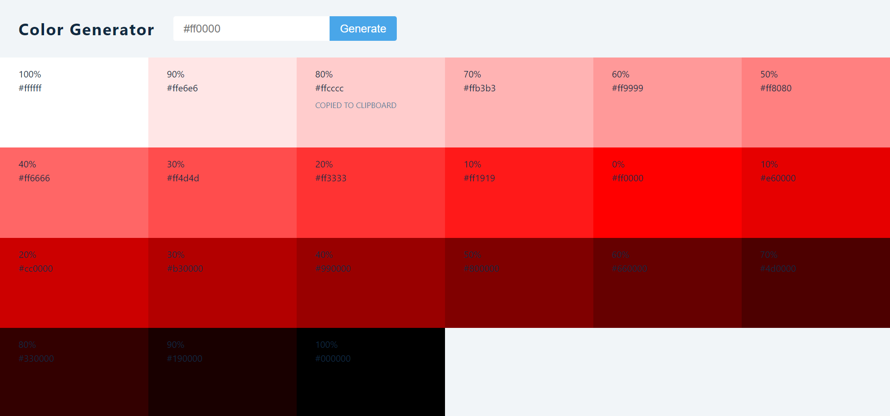

# Color Generator

## Generate tints and shades of a color, for developing a color pallette

## Values JS

- For getting tints of a color.
- [values.js](https://github.com/noeldelgado/values.js)

## Preview of Web App

